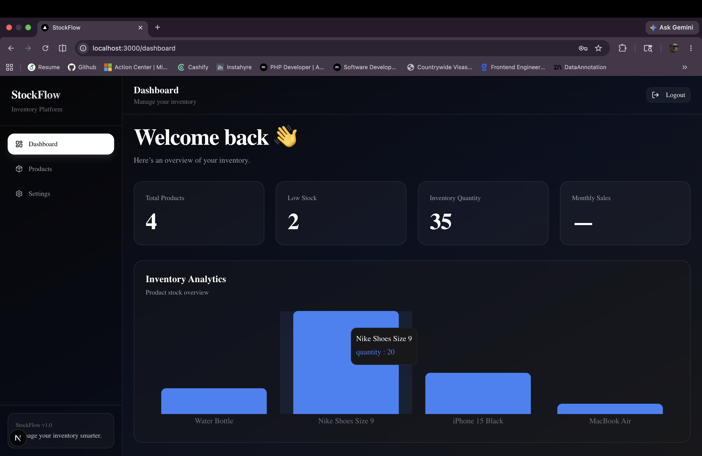
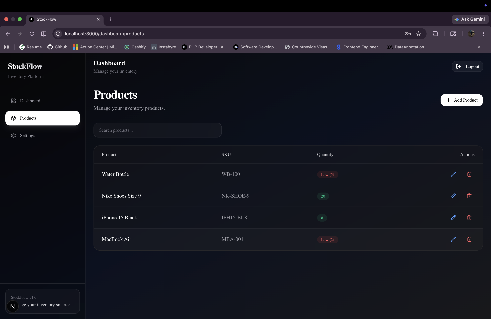
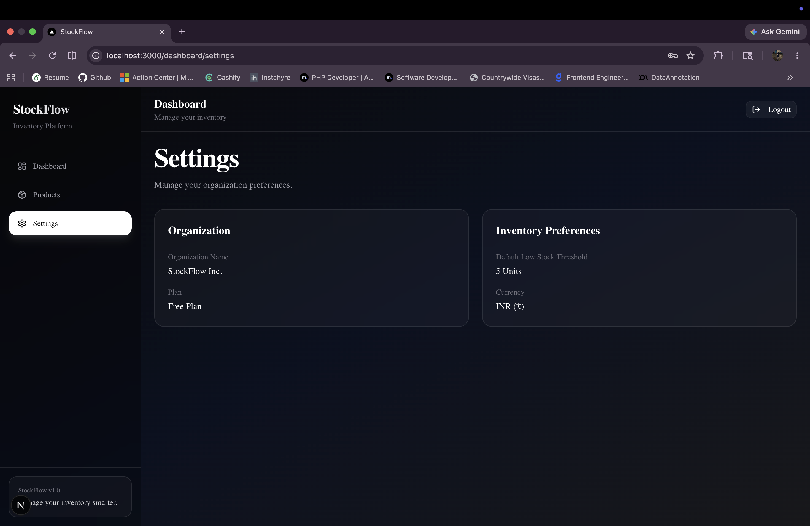

# StockFlow

Modern inventory management dashboard built with Next.js 15, Prisma, PostgreSQL, and Tailwind CSS.

## Live Demo

https://stockflow-mvp-tawny.vercel.app/

## Features

- Authentication
- Dashboard analytics
- Product management
- Add/Edit/Delete products
- Search products
- Low stock indicators
- Inventory analytics chart
- Responsive dark UI

## Tech Stack

- Next.js 15
- TypeScript
- Prisma ORM
- PostgreSQL
- Tailwind CSS
- Shadcn UI
- Recharts
- JWT Authentication

## Installation

```bash
npm install
```

## Environment Variables

Create a `.env` file:

```env
DATABASE_URL=
JWT_SECRET=
```

## Run Locally

```bash
npm run dev
```

Open:

```bash
http://localhost:3000
```

## Screenshots

### Dashboard



### Products



### Settings



## Author

Renuka Radharam
